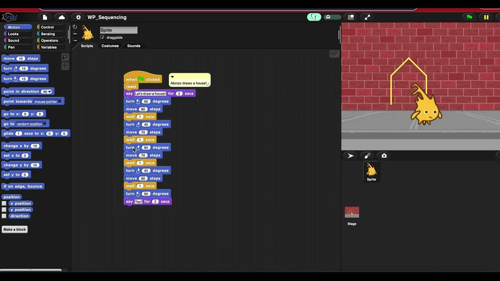
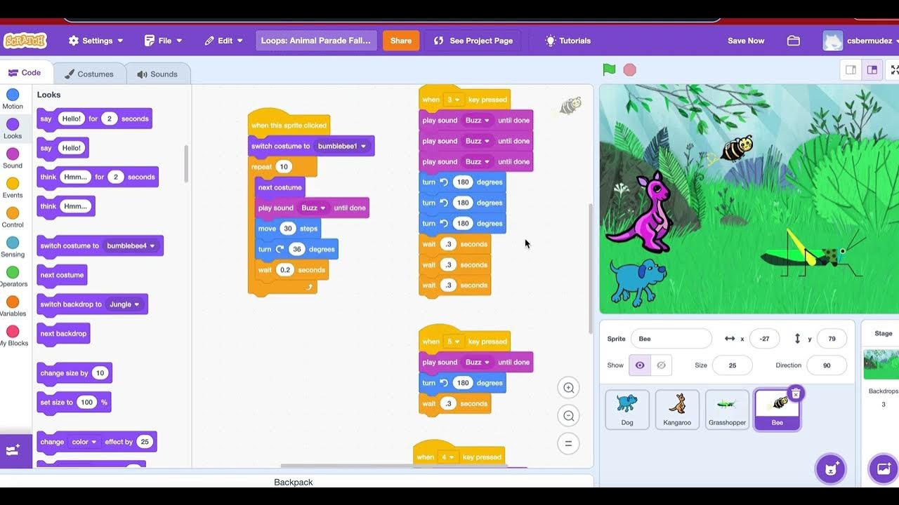
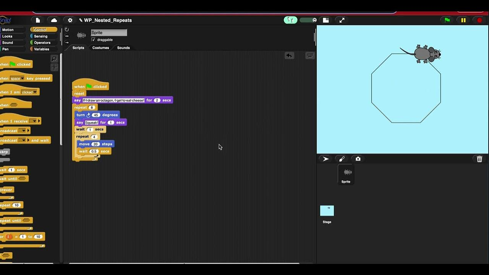
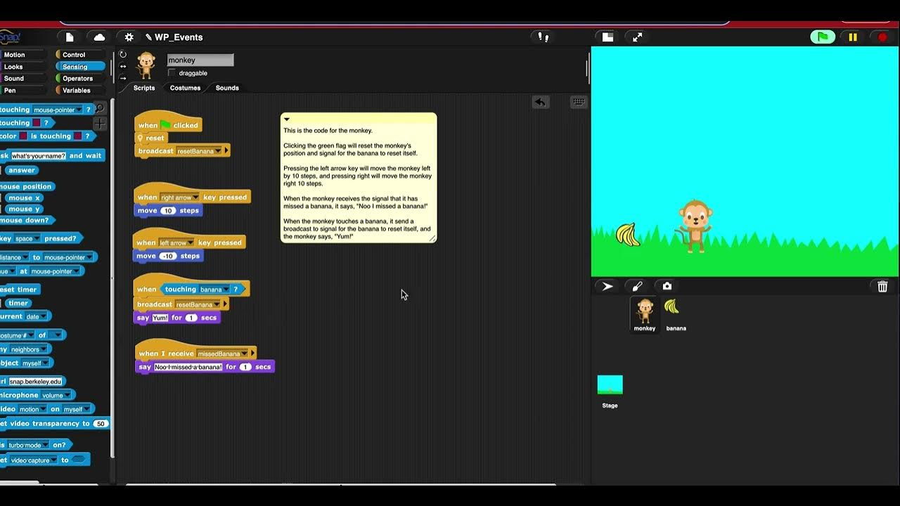
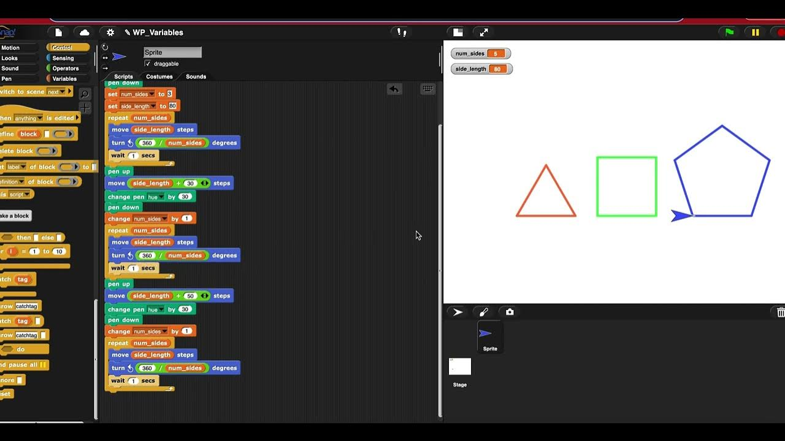
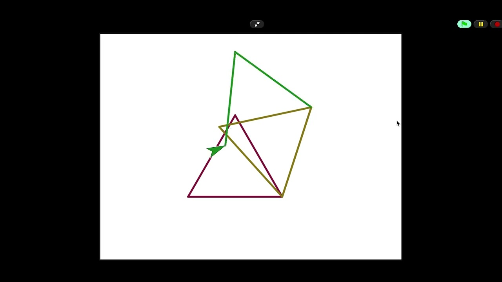
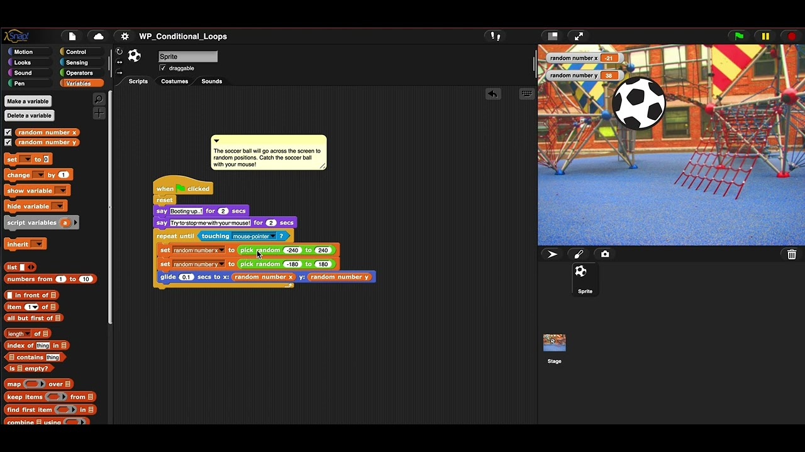
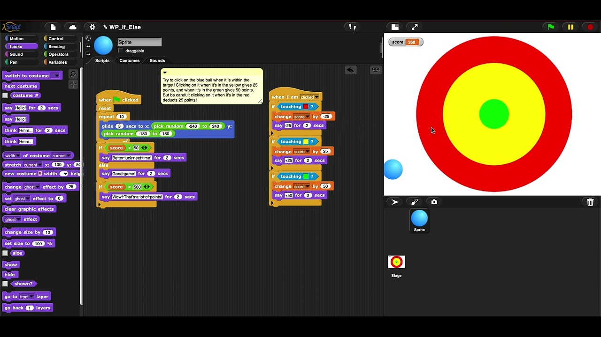
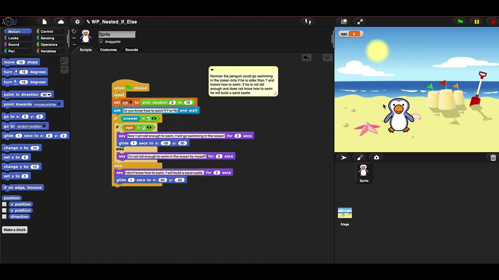
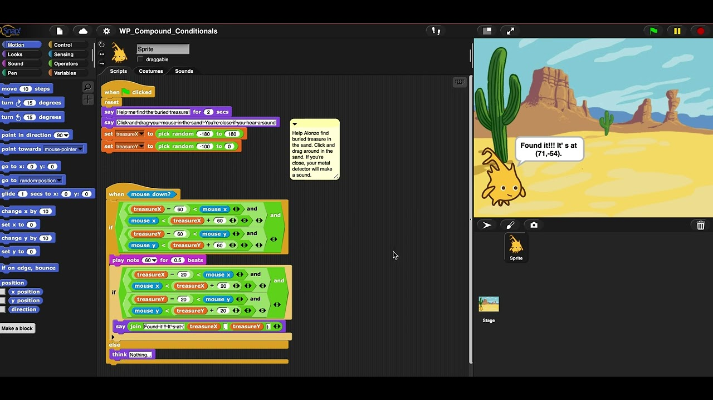

# ***About Me*** 
I'm a second year Computer Engineering student at UCSD.
### Email:<tab><tab> csbermudez@ucsd.edu

## Weeks
&ensp;&ensp;&ensp;[Week 1](#week-1)&ensp;&ensp;&ensp;[Week 2](#week-2)&ensp;&ensp;&ensp;[Week 3](#week-3)&ensp;&ensp;&ensp;[Week 4](#week-4)&ensp;&ensp;&ensp;[Week 5](#week-5)&ensp;&ensp;&ensp;
[Week 6](#week-6)&ensp;&ensp;&ensp;[Week 7](#week-7)&ensp;&ensp;&ensp;[Week 8](#week-8)&ensp;&ensp;&ensp;[Week 9](#week-9)&ensp;&ensp;&ensp;[Week 10](#week-10)&ensp;&ensp;&ensp;
## Week 1
- Peer-graded Assignment: Show What You Know: Explain Your Program(Sequencing: Write a Program)\
  
  
## Week 2
- Peer-graded Assignment: Show What You Know: Write and Explain A Program (Repeats: Write a Program)\
   
- Peer-graded Assignment: Teaching Programming Portfolio - Lesson Plan (Scratch Loop "Quest")
   
  
## Week 3
- Peer-graded Assignment: Show What You Know: Write and Explain A Program (Nested Repeats: Write a Program)\
  
- Peer-graded Assignment: Show What You Know: Write and Explain A Program (Events: Write a Program)
- 
  
## Week 4
- Peer-graded Assignment: Show What You Know: Write and Explain A Program (Variables: Write a Program)\
  
- Peer-graded Assignment: Create a Parsons' Problem for Teaching:\
  
  
  
## Week 5
- Week 5: Peer-graded Assignment: Show What You Know: Write and Explain A Program (Conditional Loop: Write a Program)\
   

## Week 6
- Week 6: Peer-graded Assignment: Show What You Know: Write and Explain A Program (If-Else: Write a Program)\
   
  
## Week 7
- Week 7: Peer-graded Assignment: Show What You Know: Write and Explain A Program (Nested If-Else: Write a Program)\
   

## Week 8
- Week 8: Peer-graded Assignment: Show What You Know: Write and Explain A Program (Compound Conditionals: Write a Program)\
   

## Week 9
- Week 9:
  
## Week 10
- Week 10:
  
---
