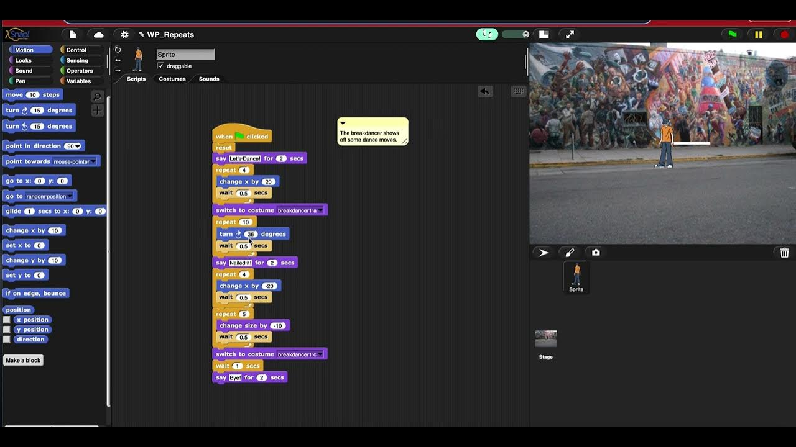

# ***About Me*** 
I'm a second year Computer Engineering student at UCSD.
### Email:<tab><tab> csbermudez@ucsd.edu

## Week 1
- Peer-graded Assignment: Show What You Know: Explain Your Program(Sequencing: Write a Program)\
  
  
## Week 2
- Peer-graded Assignment: Show What You Know: Write and Explain A Program (Repeats: Write a Program)\
   
- Peer-graded Assignment: Teaching Programming Portfolio - Lesson Plan (Scratch Loop "Quest")
   
  
## Week 3
-
  
## Week 4
- Week 4:
  
## Week 5
- Week 5:

## Week 6
- Week 6:
  
## Week 7
- Week 7:

## Week 8
- Week 8:
  
## Week 9
- Week 9:
  
## Week 10
- Week 10:
  
---
